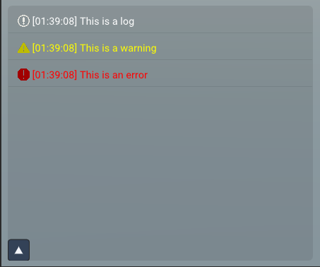

[Table of Content](TableOfContent.md)
***

# Debugging

For Debugging purposes there is a special window at the bottom right.
It can be opened by clicking on the arrow.
There are three usable functions to show debug messages together with a time stamp:

```cpp
log("This is a log");
warn("This is a warning");
error("This is an error");
```


<div style="text-align: left;">
    
</div>
