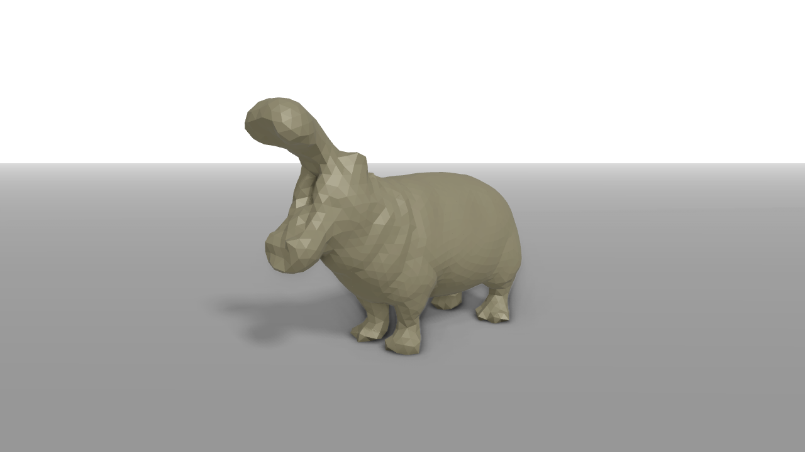
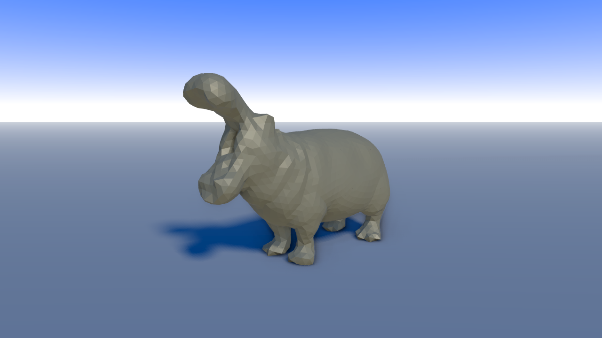
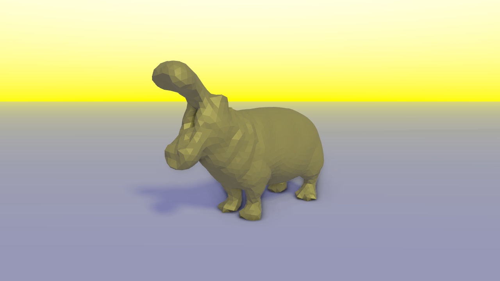
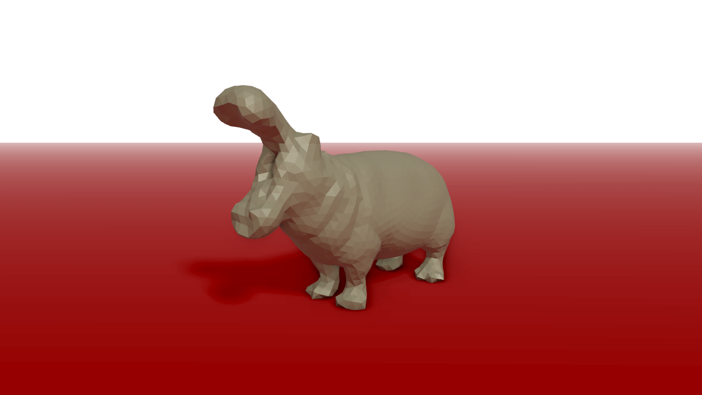

[Table of Content](TableOfContent.md)
***

# Environment

## Ground
```cpp
use_ground(true);
set_ground_color(std::array<float,3>{1.0, 1.0, 1.0});

use_grid(true);
set_grid_color(std::array<float,3>{0.5, 0.5, 0.5});

set_ground_height(-5.0f);
```

The floor consists of a solid part and a grid. Both can be assigned an individual color. The height counts for both. The solid ground receives shadows.


## Light

VolumeshOS has one global light. Its direction and color affects lighting and shadows and also the sky gradient.

```cpp
// direction
std::array<float, 4> dir = {0.5f, 1.0f, 1.0f};
set_light_direction(dir);

// color
std::array<float, 4> col = {1.0f, 1.0f, 1.0f};
set_light_color(col);

//intensity
set_light_intensity(5.0f);
```


## Sky

In order to beautify the ambience, the background can be changed by setting a sky color.
It also affects physically based rendering (PBR).
In addition to that there is also a fog with a certain color and density.

```cpp
// sky color
std::array<float, 4> sky_col = {0.5f, 0.75f, 0.8f};
set_sky_color(sky_col);

// fog density
set_fog_density(0.05f);

// fog color
std::array<float, 4> fog_col = {0.5f, 0.75f, 0.8f};
set_fog_color(fog_col);
```

### Environmental influence on lighting
Some of the settings above have an influence on the lighting:

* Standard 
<div style="text-align: left;">
    
</div>

***

* Sky Color
<div style="text-align: left;">
    
</div>
<figcaption style="width: 100%;">
    The sky color reflects on the ground and the upper part of the mesh.
</figcaption>

***

* Light
<div style="text-align: left;">
    
</div>
<figcaption style="width: 100%;">
    The light color affects the whole mesh and ground. It also influences the sky gradient.
</figcaption>

***

* Ground
<div style="text-align: left;">
    
</div>
<figcaption style="width: 100%;">
    The ground color affects the lower part of the mesh.
</figcaption>
