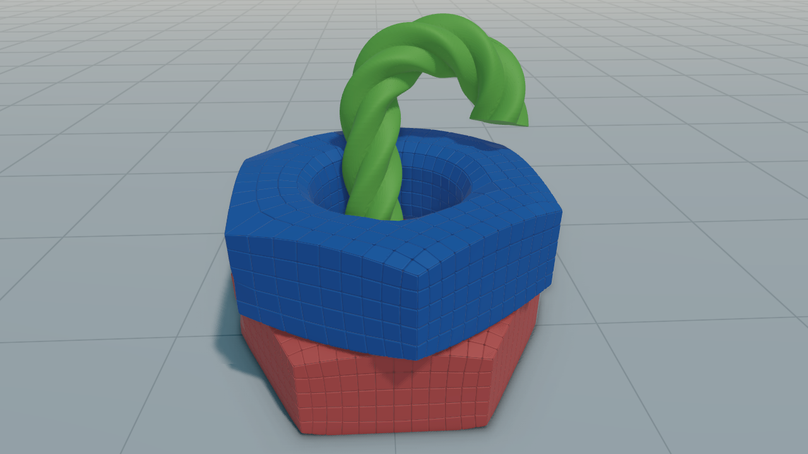
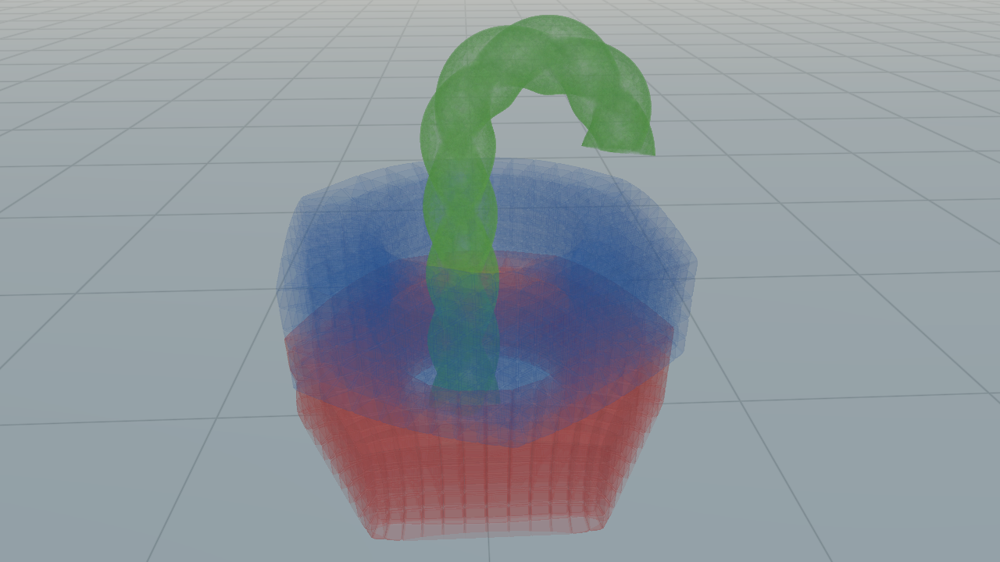

# Graphics
To improve the three-dimensional impression there are some options. 
At the moment further settings can only be made in the viewer.


## Shadows
VolumeshOS uses cascaded shadow maps with up to 8 cascades.
More `cascades` result in a better quality shadow, but also needs more computational power.
The `shadow strength` controls the darkness of the shadow. 
Set a higher `penumbra width` for a softer shadow.

```cpp
use_shadows(true);

// settings
set_shadow_cascades(8);
set_shadow_strength(0.8f);
set_shadow_penumbra(1.0f);
```

<div style="display:flex; justify-content:space-between;">
    
    
</div>
<figcaption style="width: 100%;">
    shadow
    (left) off,
    (right) on
</figcaption>

## Ambient Occlusion
For ambient occlusion we have a bunch of presets: `OFF`, `QUALITY`, `BALANCED` and `PERFORMANCE`.
```cpp
use_ambient_occlusion(true);

//settings
set_ambient_occlusion_preset(SSAOMode::QUALITY);
```

<div style="display:flex; justify-content:space-between;">
    
    
</div>
<figcaption style="width: 100%;">
    ambient occlusion
    (left) off,
    (right) on
</figcaption>

Ambient occlusion can be seen be seen particularly well on the spots where the mesh touches the grund, on sharp edges and in the gaps between the cells.

## Transparency
There are two different transparency modes: `DEPTH_PEELING` and `WEIGHTED_BLENDED`.
`Depth peeling` is an order independent method that produces accurate transparency. Therefore, the
number of `passes` sets how many layers are blended. A higher number leads to a better result, but also causes
higher computing time. The `weightet-blended` order-independent transparency calculation method, on the other hand, is just an approximation, but is
more performant.

```cpp
use_transparency(true);

// settings
set_transparency_mode(TransparencyMode::DEPTH_PEELING);
set_transparency_passes(15); // passes for depth peeling
```
<div style="display: flex; flex-wrap: wrap; gap: 5px;">
  
  
  
  
</div>
<figcaption style="width: 100%;">
    transparency
    (left) off,
    (right) on
</figcaption>

Note that transparent meshes does not cast shadow.

## Post Processing
Finally, some post processing values (`gamma`, `saturation`, `contrast`) can be set.
```cpp
set_gamma(2.4);
set_saturation(1.0);
set_contrast(1.0);
```

***
[Table of Content](TableOfContent.md)