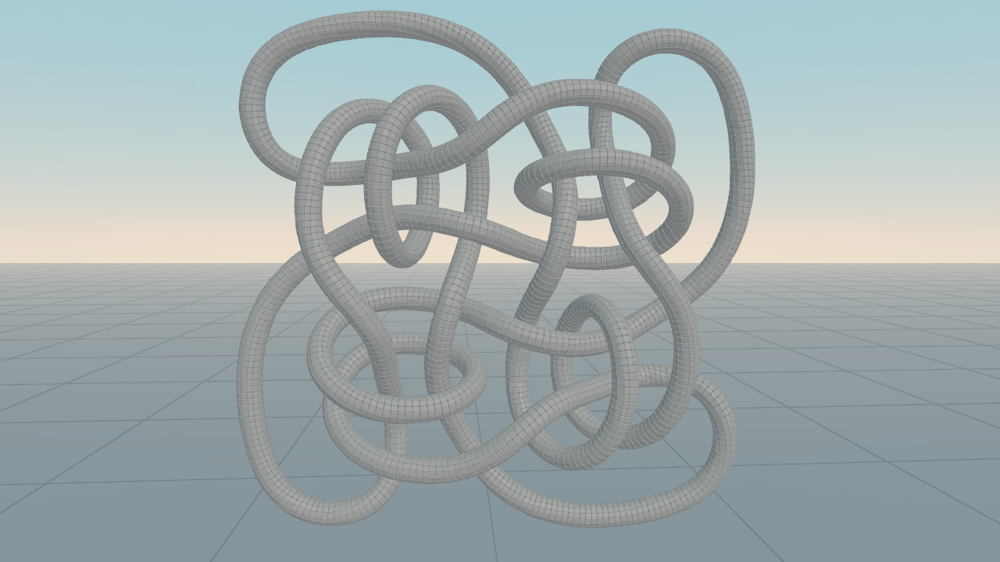
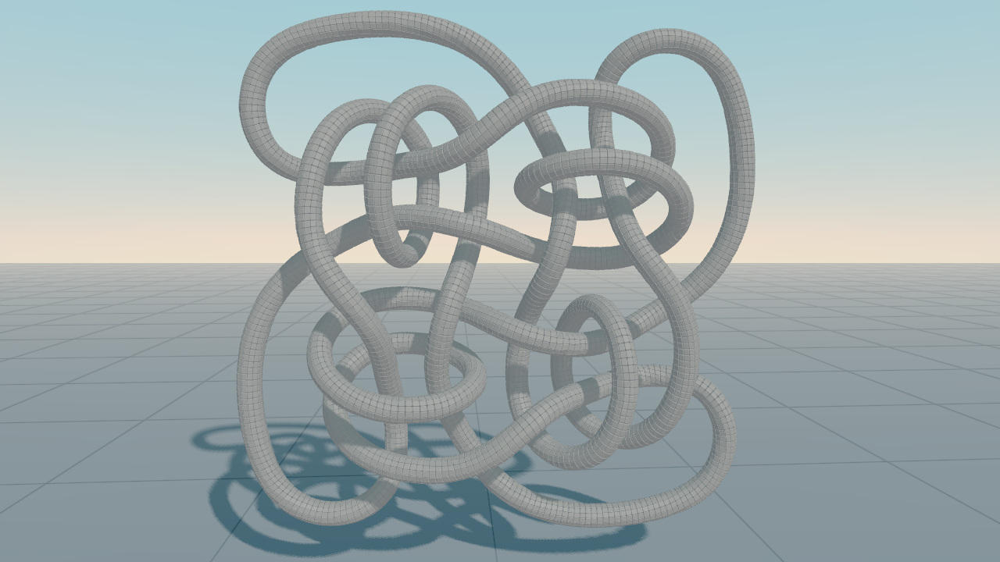
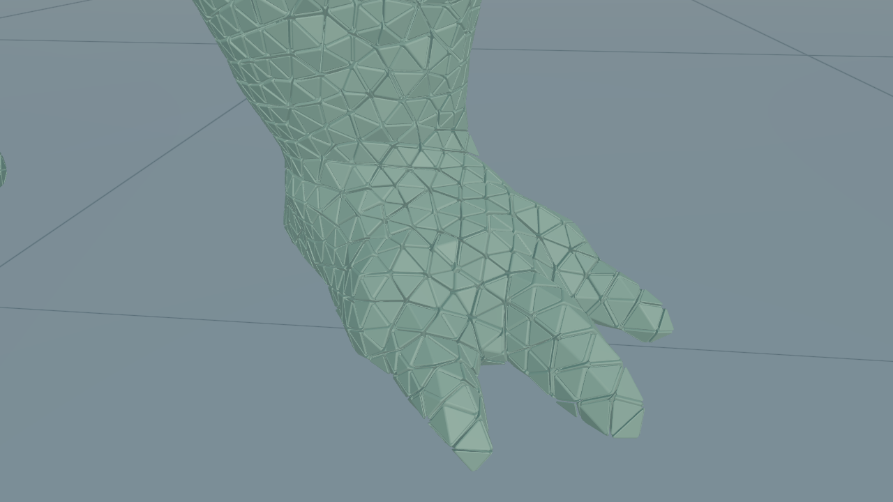
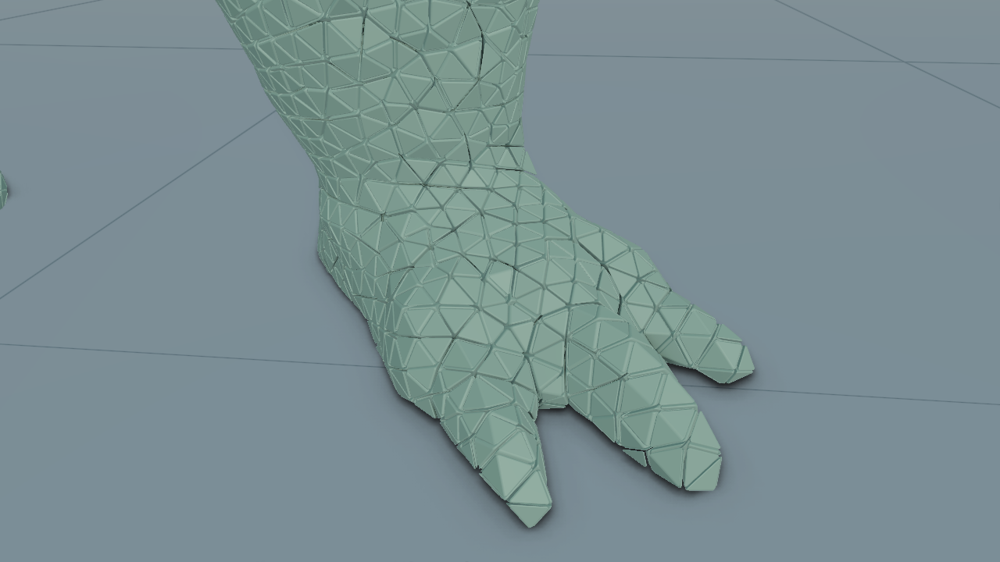
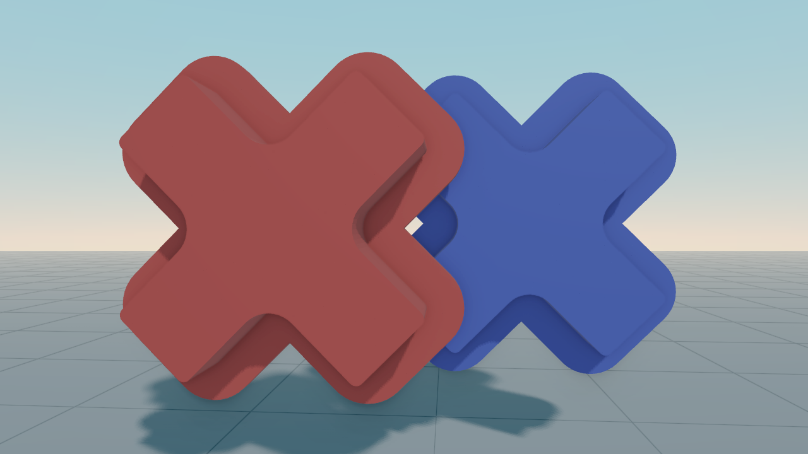
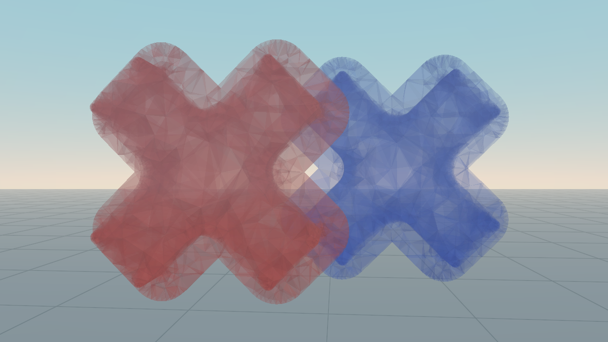

# Graphics
To improve the three-dimensional impression there are some options. 
At the moment further settings can only be made in the viewer.


## Shadows
VolumeshOS uses cascaded shadow maps with up to 8 cascades.
More `cascades` result in a better quality shadow, but also needs more computational power.
The `shadow strength` controls the darkness of the shadow. 
Set a higher `penumbra width` for a softer shadow.

```cpp
use_shadows(true);

// settings
set_shadow_cascades(8);
set_shadow_strength(0.8f);
set_shadow_penumbra(1.0f);
```



## Ambient Occlusion
For ambient occlusion we have a bunch of presets: `OFF`, `QUALITY`, `BALANCED` and `PERFORMANCE`.
```cpp
use_ambient_occlusion(true);

//settings
set_ambient_occlusion_preset(SSAOMode::QUALITY);
```




## Transparency
There are two different transparency modes: `DEPTH_PEELING` and `WEIGHTED_BLENDED`.
While depth peeling displays an exact transparency it takes a lot of computational power. Therefore, the
number of `passes` sets how many layers are blended.
```cpp
use_transparency(true);

// settings
set_transparency_mode(TransparencyMode::DEPTH_PEELING);
set_transparency_passes(15); // passes for depth peeling
```




## Post Processing
Finally, some post processing values (`gamma`, `saturation`, `contrast`) can be set.
```cpp
set_gamma(2.4);
set_saturation(1.0);
set_contrast(1.0);
```
