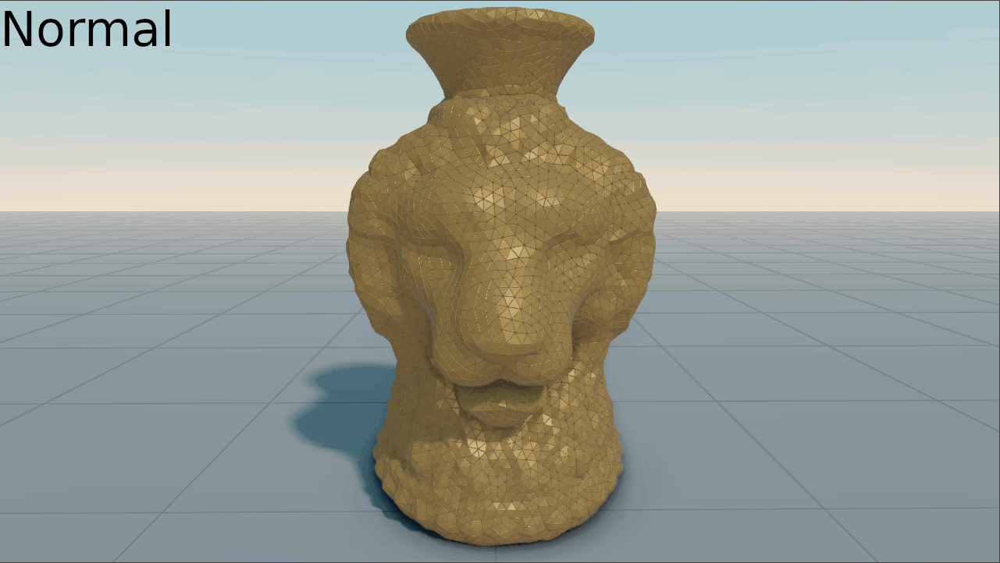

[Table of Content](TableOfContent.md)
***

# Screenshots
For Screenshots there is an `ExportOptions` object. 
Currently `.png` are `.bmp` are supported. 
When rendering screenshots, the background, ground, and shapes can be excluded. 
In addition, the shadows of the floor can be separated transparently.


```cpp
ExportOptions options;
options.width = 1280;
options.height = 720;
options.include_background = true;
options.include_shapes = true;
options.include_ground = true;
options.ground_shadow_only = false;

export_image("screenshot.png", options);
```


 