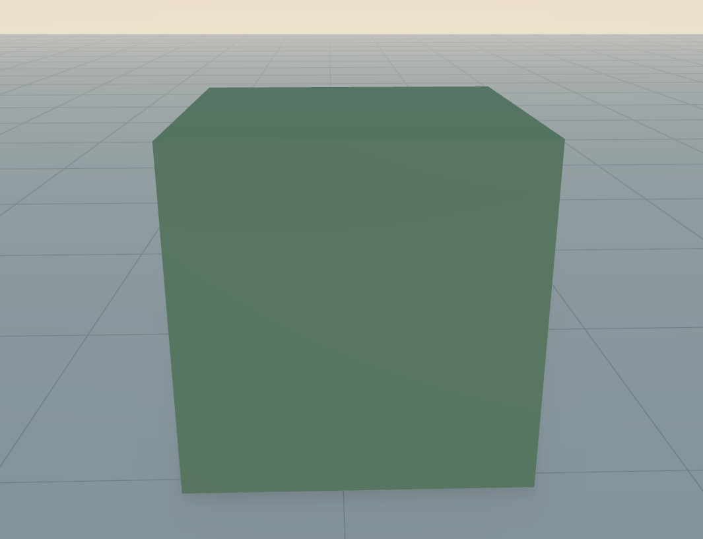
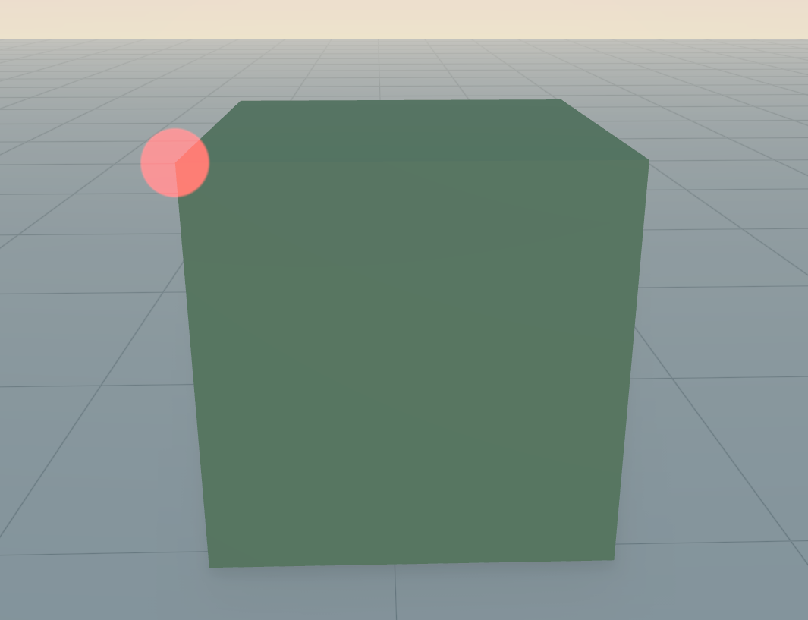
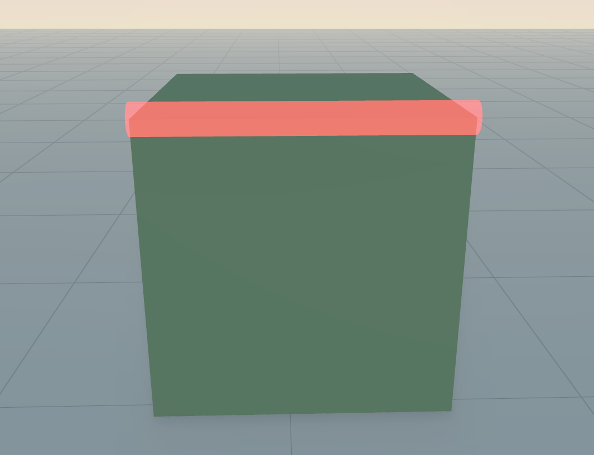
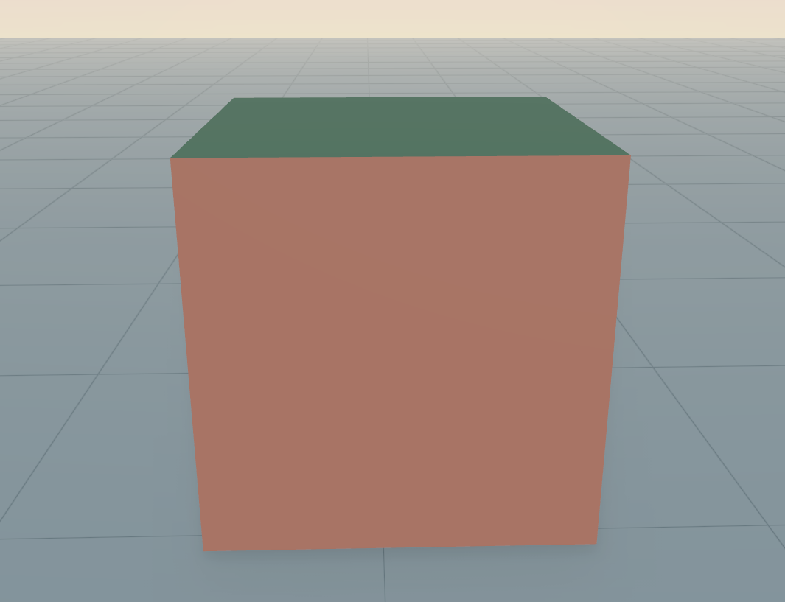
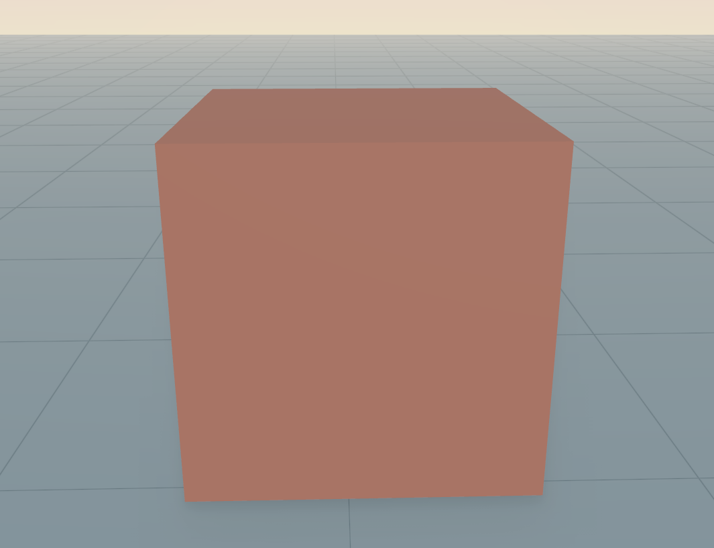

# Selection

```cpp
set_selection_mode(SelectionMode::CELL);

on_cell_select([](VMesh mesh, OpenVolumeMesh::CellHandle ch){
    log("Cell " + std::to_string(ch.uidx()) + " was selected");
});
```
The Selection feature is disabled by default. `OFF`, `VERTEX`, `EDGE`, `FACE`, `CELL` and `ALL` are selectable.
In addition to that the programmer can define a callback function that is called when the corresponding entity is selected. 
In this case we use the internal logging system to output the index of the selected cell.
Other possibilities are to change the color or append a shape at the entity's position.

<div style="display:flex; justify-content:space-between;">
    
    
    
    
    
</div>

***
[Table of Content](TableOfContent.md)