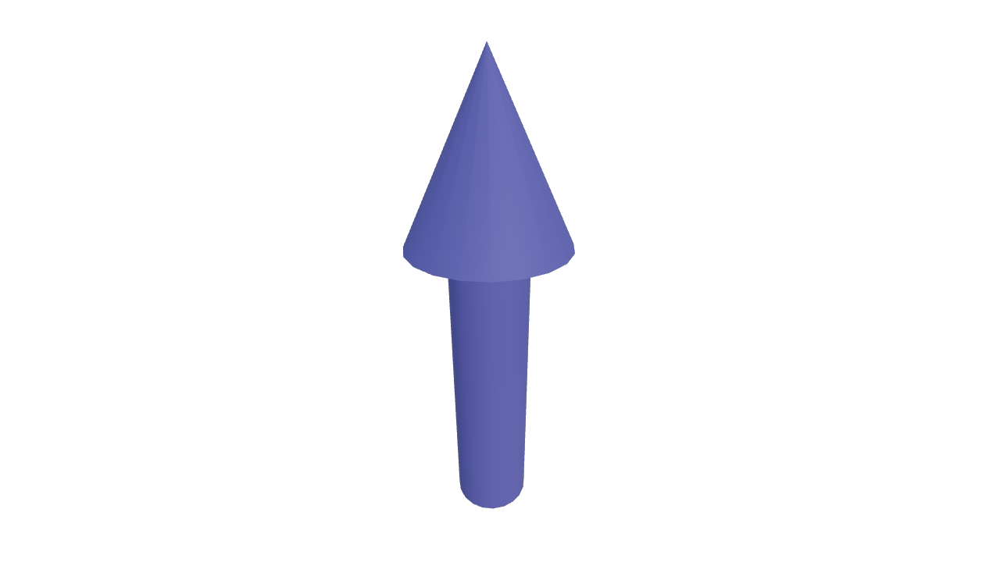
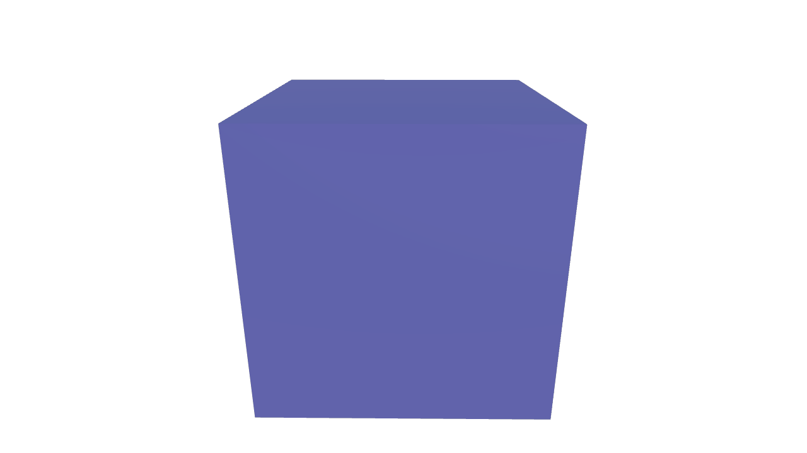
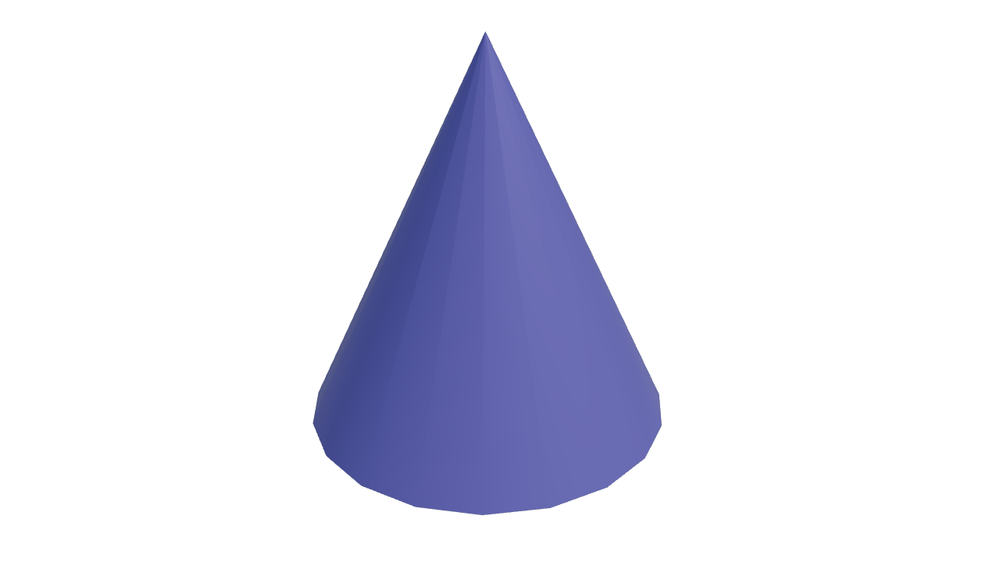
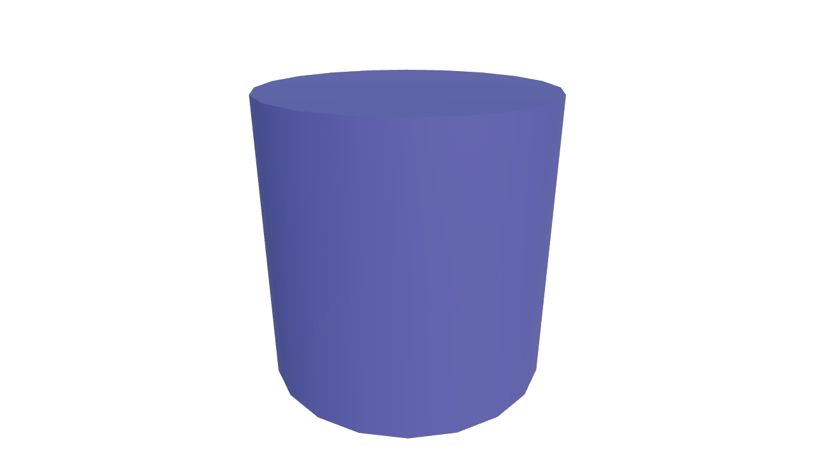
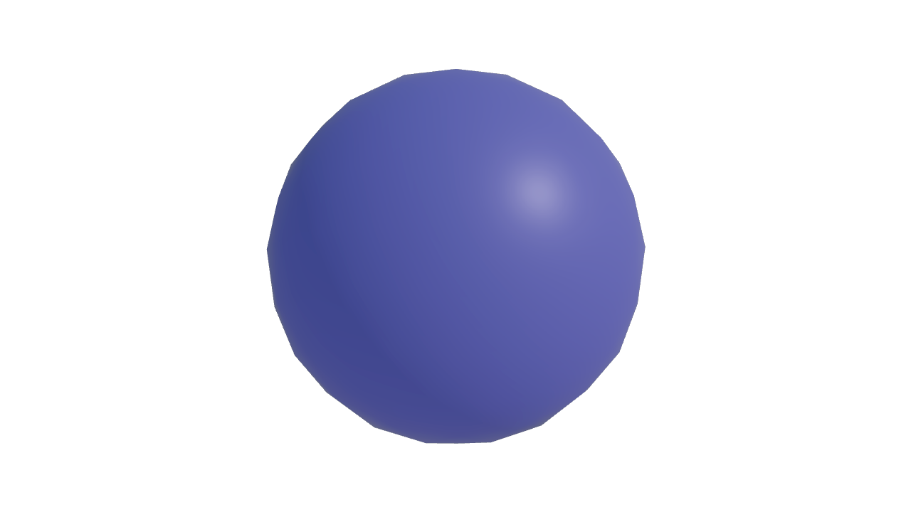

# Shapes

In Addition to the meshes we offer a variety of shapes:
- Box
- Cylinder
- Sphere
- Cone
- Arrow

A shape can either be added relative to the world, relative to the mesh 
or relative to a cell. To add a shape use `add_shape<VShape>()`. 
```cpp
VCylinder cylinder_world = add_shape<VCylinder>();
VCylinder cylinder_mesh = mesh.add_shape<VCylinder>();
VCylinder cylinder_cell = mesh.add_shape<VCylinder>(ch);  // ch=CellHandle
```
Similar to the `VMesh` you get a `VShape` (in this case `VCylinder`) in return. 
Now various attributes of the shape can be set:

```cpp
// position, orientation, scale
cylinder.set_position(pos);
cylinder.set_direction(pos);
cylinder.set_scale(s);

//color
cylinder.set_color(color);
```
For some shapes there are additional attributes:
```cpp
VArrow arrow = mesh.add_shape<VArrow>(ch);
arrow.set_tip_height();
arrow.set_base_width();
```

Shapes have their own lighting which can be manipulated as follows:
```cpp
// set lighting mode
set_shape_lighting_mode(LightingMode::PBR);

// settings for phong lighting
set_shape_ambient(1.0f);
set_shape_diffuse(1.0f);
set_shape_specular(0.15f);
set_shape_specular_coefficient(8.0f);

// settings for pbr lighting
set_shape_metallic(0.15f);
set_shape_roughness(0.65f);
```

<div style="display:flex; justify-content:space-between;">
    
    
    
    
    
</div>

<div style="display:flex; justify-content:space-between;">

</div>

See this [example](Example-Shapes.md) for more details

***
[Table of Content](TableOfContent.md)