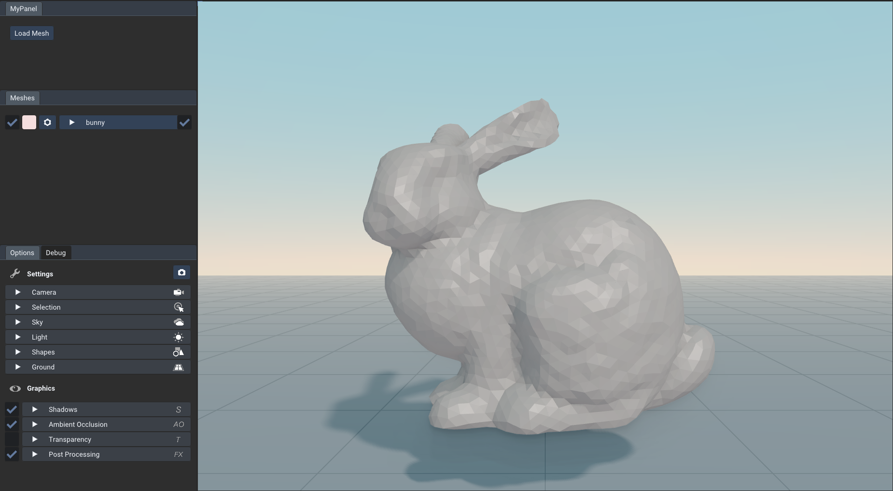

[Table of Content](TableOfContent.md)
***

# Your First Program

The simplest volumeshOS program looks like this:
```c
#include "volumeshOS.h"

using namespace volumeshOS;

int main()
{
    load("path/to/ovm_file.ovm");
    open();
}
```
First include `volumeshOS.h`. Then load a mesh and open the viewer. 

<div style="display:flex; justify-content:space-between;">
    
</div>
<figcaption style="width: 100%;">
    Example view
</figcaption>
