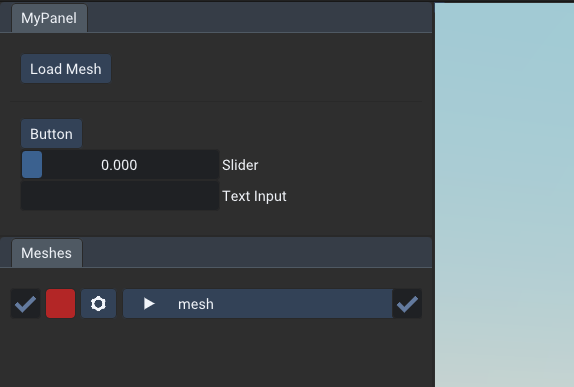

[Table of Content](TableOfContent.md)
***

# Your Own GUI
The viewer provides a section where own GUI elements can be placed. For this we use [ImGui](https://github.com/ocornut/imgui). 
## Load Mesh Button
```cpp
on_gui_render([](){
    ImGui::Begin("MyPanel");
    if (ImGui::Button("Load Mesh"))
    {
        // open a file manager to select an ovm file
        auto mesh = load_from_dialog("Select OVM file");
    }
    ImGui::End();
});

```
This feature can especially useful to create a button to load meshes with a file dialog.
The `on_gui_render` function takes a callback function that is called once per frame when the GUI is rendered.
In this example we use ImGui to create a button that calls the `load_from_dialog` function.


<div style="display:flex; justify-content:space-between;">
    
</div>
<figcaption style="width: 100%;">
    Custom GUI panel with additional button, slider and text input
</figcaption>
